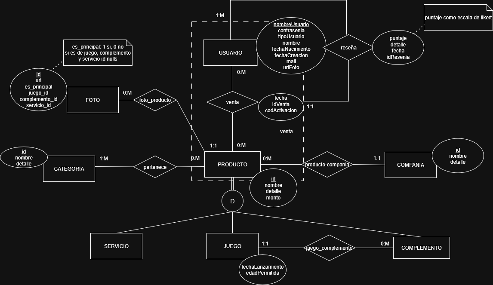

# Propuesta TP DSW

## Grupo

### Integrantes

- 52479 - Brizio, Augusto
- 52850 - Conti, Stefano
- 53137 - Vitali, Bruno

### Repositorios

- [frontend app](https://github.com/pepicont/desarrollo-FE-tp)
- [backend app](https://github.com/pepicont/desarrollo-BE-tp)

## Link del deploy

<a href="https://portaldevideojuegos-l8sue.ondigitalocean.app"><u>https://portaldevideojuegos-l8sue.ondigitalocean.app</u></a>

## Link del video subido a YouTube

<a href="link_video"><u>Pendiente de filmación...</u></a>

## Tema

### Descripción

El negocio consiste de un portal de videojuegos donde un usuario luego de iniciar sesión con su cuenta en el sitio podrá acceder al catálogo de los mismos, ampliar sobre los detalles de estos pudiendo visualizar sus detalles, reseñas diversas de otros usuarios, compañía desarrolladora entre otras cosas. A su vez, también podrá acceder a un catálogo de complementos sobre estos videojuegos o membresías mensuales de los canales de streaming y/o servicios del momento. Cualquiera sea el producto al que el usuario desee acceder, este seleccionará el mismo y se le mostrará un código de cupón para poder canjearlo en Steam o la página del servicio y hacer uso de su producto.

### Modelo

Link: https://drive.google.com/file/d/1Yka-HRDaMmvCM-fxjBVcX36k_-_MT6ZQ/view?usp=sharing

_Nota_: incluir un link con la imagen de un modelo, puede ser modelo de dominio, diagrama de clases, DER. Si lo prefieren pueden utilizar diagramas con [Mermaid](https://mermaid.js.org) en lugar de imágenes.

## Alcance Funcional

### Alcance Mínimo

Regularidad:
|Req|Detalle|
|:-|:-|
|CRUD simple|1. CRUD Usuario 2. CRUD Compañía 3. CRUD Categoría|
|CRUD dependiente|1. CRUD Juego {depende de} CRUD Categoría y CRUD Compañía 2. CRUD Servicio {depende de} CRUD Categoría y CRUD Compañía  3. CRUD Complemento {depende de} CRUD Categoría y CRUD Compañía
|Listado + detalle| 1. Listado de productos filtrado por nombre producto, rango de precios, compañia, tipo producto, edad permitida => detalle CRUD Producto   2. Listado de ventas filtrado por nombre producto, rango de fecha, tipo producto, compañía => detalle crud venta|
|CUU/Epic|1. Hacer una compra de un producto  2. Realizar una reseña sobre una venta|

Adicionales para Aprobación
|Req|Detalle|
|:-|:-|
|CRUD Dependiente| - |
|Listado + detalle| 1. Listado Reseñas propias filtrado nombre producto y por rango de fechas|
|CUU/Epic|1. Moderar reseña (con API de IA o Librería) 2. Realizar compra de un producto (pago, con API (ej: MercadoPago))|

### Alcance Adicional Voluntario

_Nota_: El Alcance Adicional Voluntario es opcional, pero ayuda a que la funcionalidad del sistema esté completa y será considerado en la nota en función de su complejidad y esfuerzo.

| Req                     | Detalle                                                                                                                                                                                                                                                                                                                                                                                                                                                                                                                                                                                                                                                                                                                                                                                                                      |
| :---------------------- | :--------------------------------------------------------------------------------------------------------------------------------------------------------------------------------------------------------------------------------------------------------------------------------------------------------------------------------------------------------------------------------------------------------------------------------------------------------------------------------------------------------------------------------------------------------------------------------------------------------------------------------------------------------------------------------------------------------------------------------------------------------------------------------------------------------------------------- |
| Listado + detalle | 1. Listado de todas las Reseñas filtrado nombre producto, nombre de usuario, comentarios, por rango de fechas, ordenado por fecha ascendete/descendente y valoración. Detalle CRUD reseña + nombreUsuario + nombreProducto   2. Listado Usuarios ordenado por fechaCreacion. Detalle nombreUsuario, avatar, email y fechaCreacion   3. Listado todas las Compras filtrado nombre producto, nombre de usuario, mail, código de activación, por rango de fechas, tipoProducto, ordenado por fecha o monto ascendete/descendente. Detalle CRUD Compra + nombre y detalle del producto + detalle usuario + montoTotalFiltrado   4. Listado todas las Compañias ordenadas por Nombre. Detalle nombre y detalle de la Compañia   5. Listado Categorias ordenadas por Nombre. Detalle nombre y detalle de la Categorias |
| CUU/Epic                | 1. Servicio de mailing para notificar al usuario de diversos eventos                                                                                                                                                                                                                                                                                                                                                                                                                                                                                                                                                                                                                                                                                                                                                         |
